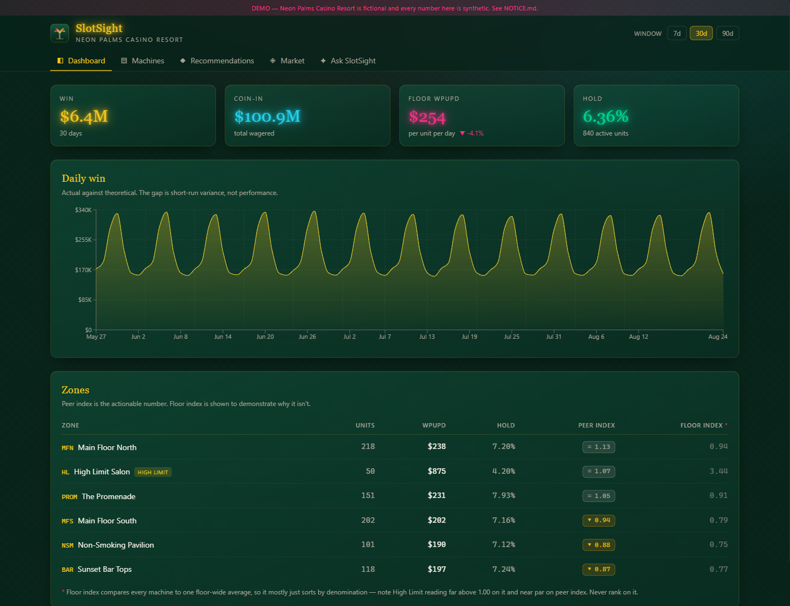
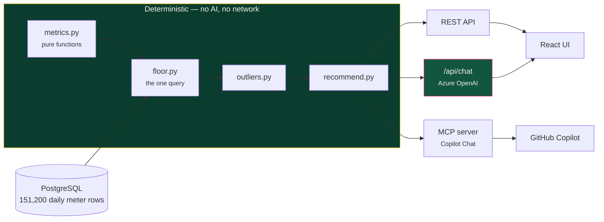
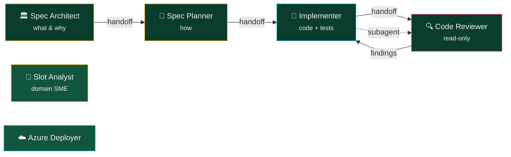

<div align="center">


# SlotSight

### Intelligent slot floor performance assistant — and a working reference for **spec-driven development with GitHub Copilot**

[](https://python.org)
[](https://fastapi.tiangolo.com)
[](https://react.dev)
[](https://typescriptlang.org)
[](https://docker.com)
[](https://azure.microsoft.com)
[](LICENSE)

**115 tests** · **5 MCP servers** · **6 custom agents** · **4 lifecycle hooks** · **0 secrets**

</div>

---

> [!IMPORTANT]
> **Everything here is fictional.** Neon Palms Casino Resort does not exist. Every
> machine, every dollar, every game title, and every market benchmark is generated
> from a fixed seed. There is no real operator data, no scraping, and no
> affiliation with any real casino or data provider. See [`NOTICE.md`](NOTICE.md).

---

## What this actually is

Two things, and the second one is the point.

**1. A working slot floor analytics product.** Ask it *"which of our penny video
slots are underperforming this month?"* and it answers with real numbers from a
real database, names the banks, cites its evidence, and recommends what to convert
them to.

**2. A complete, working example of every way you can configure GitHub Copilot in
VS Code** — repository instructions, path-scoped instructions, custom agents with
handoffs, prompt-file slash commands, agent skills, lifecycle hooks, and five MCP
servers including one this repo builds itself.

The app exists so the *process* has something to point at.

<div align="center">

</div>

---

## 60-second start

```bash
git clone https://github.com/<you>/demo-SlotSight.git
cd demo-SlotSight
make setup          # installs deps, wires the git hooks
make up             # docker compose: postgres + seed + api + web
```

Open **http://localhost:5173**. That is it — no cloud account, no API key, no
configuration. The synthetic floor generates itself on first run.

> [!NOTE]
> The conversational **Ask SlotSight** feature needs Azure OpenAI. Everything else
> — dashboard, machines, recommendations, market — is deterministic SQL and works
> with no cloud dependency at all. See [Getting started](docs/getting-started.md).

---

## 🎰 The architectural idea

> **The analytics are deterministic. The AI only phrases the answer.**



**Three surfaces, one implementation.** The REST API, the chat endpoint, and the
MCP server all call the same functions. The model selects which deterministic
function to run and writes prose over numbers it did not choose.

The consequence is the property that makes it trustworthy: **every figure the
assistant quotes is one a test already covers, and it cannot invent a number even
if it tries.** Each chat answer ships the exact tool calls that produced it, so
you can re-run them through the REST API and get the same result.

### The one metric that matters

A machine's **peer index** compares it to the same denomination and game type. Its
**floor index** compares it to everything.

| Zone | Floor index | Peer index |
|---|---:|---:|
| High Limit Salon | **3.44** | **1.07** |

Both numbers describe the same 50 machines. The first says High Limit is
outperforming the floor by 244%; the second says it is doing slightly better than
comparable machines. **Only the second is true in any useful sense** — the first
just re-renders the denomination column as a ratio.

Rank on floor index and every penny machine looks like a removal candidate. This
repo returns both, ranks on neither but peer index, and shows the gap in the UI so
you can see the trap. More: [Slot analytics primer](docs/slot-analytics-primer.md).

---

## 🤖 The Copilot configuration surface

Every extension point, with a real working example.

| What | Where | What it does here |
|---|---|---|
| **Repo instructions** | [`.github/copilot-instructions.md`](.github/copilot-instructions.md) | The five non-negotiable rules, always in context |
| **`AGENTS.md`** | [`AGENTS.md`](AGENTS.md) | Agent-host entry point |
| **Path instructions** | [`.github/instructions/`](.github/instructions/) | 7 files with `applyTo` globs — Python, React, tests, Bicep, data, security, docs |
| **Custom agents** | [`.github/agents/`](.github/agents/) | 6 agents wired with `handoffs` so one click walks the whole spec flow |
| **Prompt files** | [`.github/prompts/`](.github/prompts/) | 8 slash commands: `/spec-new`, `/spec-plan`, `/spec-implement`, `/add-metric`, … |
| **Agent skills** | [`.github/skills/`](.github/skills/) | Domain knowledge Copilot loads on demand |
| **Hooks** | [`.github/hooks/`](.github/hooks/) | 4 lifecycle hooks — **including one that blocks Copilot itself** |
| **MCP servers** | [`.vscode/mcp.json`](.vscode/mcp.json) | 5 servers, zero committed secrets |

Full walkthrough: **[docs/copilot-configuration.md](docs/copilot-configuration.md)**

### The agents hand off to each other



The **Code Reviewer has no edit tools at all.** A reviewer that can edit stops
reviewing and starts implementing, and then nobody has reviewed the result.

### 🔒 The hook that blocks Copilot

Ask Copilot to read `.env` in this repository and watch it get refused:

```
🔒 Blocked: this tool call touches the .env file.

SlotSight forbids agents reading or writing credential-bearing paths — see
SECURITY.md, layer 3. If you need configuration values, read `.env.example`,
which holds placeholders only.
```

`.gitignore` stops you *staging* a secret and CI stops you *pushing* one. Neither
stops an agent from reading `.env` and pasting it into a transcript. That is what
[`.github/hooks/scripts/guard_secrets.py`](.github/hooks/scripts/guard_secrets.py)
is for — and it has [47 tests](apps/api/tests/test_hooks.py), because a guard with
a hole in it is worse than no guard.

### Five MCP servers

| Server | Gives Copilot |
|---|---|
| `github` | Issues, PRs, Actions — OAuth, no token stored |
| `microsoft-docs` | Official Azure docs, so API versions are current not recalled |
| `context7` | Version-accurate library docs (SQLAlchemy 2.0, React 19, Pydantic v2) |
| `azure` | Live Azure resources — provision, deploy, inspect, price |
| **`slotsight`** | **The live slot floor.** Ask Copilot Chat "which banks are fading?" while you code |

The last one is [ours](apps/api/src/slotsight/mcp_server.py), and it reuses the
exact dispatch the chat endpoint uses — so the UI, the assistant, and Copilot can
never disagree about the same question.

---

## 📐 Spec-driven development

Three specs, deliberately at different stages:

| Spec | Status | Why it's here |
|---|---|---|
| [`001-slot-floor-analytics-core`](specs/001-slot-floor-analytics-core/) | ✅ Implemented | A finished worked example — including the two tasks added *during* implementation |
| [`002-conversational-insights`](specs/002-conversational-insights/) | ✅ Implemented | How the AI layer was specified without letting it compute |
| [`003-competitive-intel-feed`](specs/003-competitive-intel-feed/) | 📋 **Spec only** | **Deliberately unbuilt** — run `/spec-plan` on it live |

Spec 003 being unfinished is the point. Open it in VS Code, run `/spec-plan`, then
`/spec-implement`, and watch code get born from a specification.

Full walkthrough: **[docs/spec-driven-development.md](docs/spec-driven-development.md)**

---

## 🧪 The tests that matter

```bash
make gates                 # lint + types + tests, both apps
make test-golden           # the four planted narrative signals
```

The synthetic dataset has **four signals deliberately planted in it**, and the
golden tests assert the pipeline reaches the right *conclusion* about a floor
whose truth we control:

| Signal | Planted | Must conclude |
|---|---|---|
| 1 | Bank `NP-214` decaying over 60 days | flagged → **convert** |
| 2 | *Neon Tiki Riches* at 1.19 market index, we own none | chosen as **the target** |
| 3 | `NP-10307` reporting ~2.7× its paytable par | **bad data**, not a star |
| 4 | A zone performing well | explicit **no action** |

Signal 3 is the one worth understanding. The single highest-*winning* machine on
this floor is a **broken meter**. A rank-by-win leaderboard puts it first and
invites someone to order eight more. An analytics tool that cannot say *"I don't
believe this number"* is not safe to act on.

Signal 4 matters nearly as much: an engine that only ever flags problems trains
people to ignore it.

---

## 🔐 Security posture

Four layers, because each defeats a different failure:

| Layer | Stops | Defeated by |
|---|---|---|
| [`.gitignore`](.gitignore) | Staging `.env`, `*.pem`, `secrets/` | `git add -f` |
| [`.githooks/`](.githooks/) | Committing credential-shaped content | `--no-verify` |
| [`.github/hooks/`](.github/hooks/) | **Copilot itself** reading secrets | n/a — it targets the agent |
| [CI secret scan](.github/workflows/secret-scan.yml) | Anything above missed, **over full history** | Nothing. This is the backstop. |

**Azure OpenAI has no API key.** Auth is Entra ID via `DefaultAzureCredential` —
there is no key to leak because the application will not accept one.

**There is no PII, by design.** No player names, loyalty accounts, card numbers,
or session tracking. SlotSight models machines and money, never people. Adding a
player table here would be a defect.

Details: [`SECURITY.md`](SECURITY.md)

---

## ☁️ Deploy to Azure

```bash
azd up
```

Provisions Container Apps, PostgreSQL Flexible Server, ACR, Log Analytics, a
user-assigned managed identity, **and its own AI Foundry account with a model
deployment** — so a clean clone deploys end to end with nothing pre-existing.

RBAC, not keys. Zero secrets in Bicep. Or drive the whole thing conversationally
through the Azure MCP server: **[docs/deploy-azure.md](docs/deploy-azure.md)**

---

## 📖 Documentation

| Doc | |
|---|---|
| [Getting started](docs/getting-started.md) | Prerequisites → running in five minutes |
| [**Demo script**](docs/demo-script.md) | **Timed stage runbook — exact prompts, in order** |
| [Copilot configuration](docs/copilot-configuration.md) | Every config file, and why |
| [Spec-driven development](docs/spec-driven-development.md) | The full loop, worked |
| [Architecture](docs/architecture.md) | Diagrams, data flow, decisions |
| [Slot analytics primer](docs/slot-analytics-primer.md) | WPUPD, hold, peer index — for non-casino readers |
| [MCP servers](docs/mcp-servers.md) | All five, and how to build your own |
| [Deploy to Azure](docs/deploy-azure.md) | `azd up` and the conversational path |
| [Troubleshooting](docs/troubleshooting.md) | Including the Azure-auth-in-Docker gotcha |

---

## Stack

**Backend** Python 3.12 · FastAPI · SQLAlchemy 2.0 async · Pydantic v2 · `uv`
**Frontend** React 19 · Vite · TypeScript strict · Tailwind v4 · Recharts
**Data** PostgreSQL 16 · deterministic NumPy generator
**AI** Azure OpenAI via Entra ID · MCP
**Infra** Docker Compose · Bicep · Azure Container Apps · `azd`

---

<div align="center">
<sub>

MIT licensed · Built as a teaching reference for GitHub Copilot and spec-driven development
<br/>
**All data synthetic — see [NOTICE.md](NOTICE.md)**

</sub>
</div>
