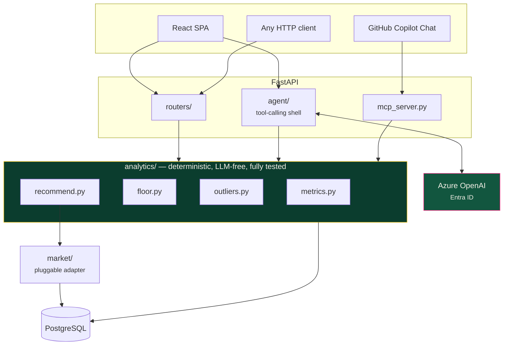
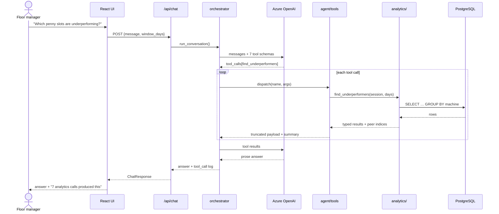
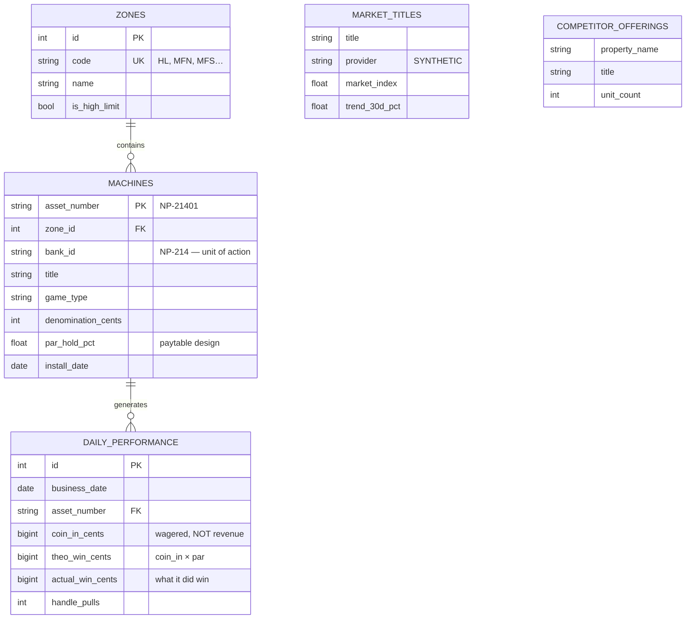
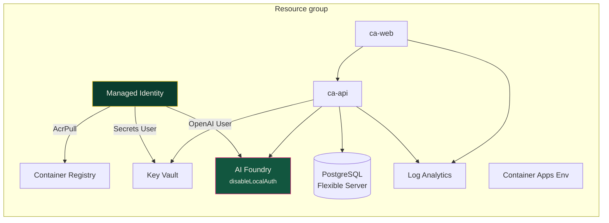

# 🏛️ Architecture

---

## The one idea

> **The analytics are deterministic. The AI only phrases the answer.**

**Three surfaces, one implementation.** `agent/` and `mcp_server.py` reach data
*only* through `analytics/`. Neither writes a query.

The consequence: every figure the assistant quotes is one a test already covers,
and the UI and the assistant cannot drift into disagreeing about the same
question — because a second implementation does not exist to drift.

---

## Request flow: a question in chat

The model never sees the database. It sees tool schemas and tool results.

---

## Data model

**Note what is absent: there is no player table.** SlotSight models machines and
money, never people. That is a deliberate architectural stance — the valuable
analytics problem here does not require PII, and collecting data you do not need
is a liability you chose.

`MARKET_TITLES` and `COMPETITOR_OFFERINGS` have no foreign keys into the floor
on purpose: they represent *external* data, and modelling them as related would
imply a join that does not exist in reality.

---

## Decisions, and what they cost

### Money as integer cents

Stored `BigInteger`, summed as integers, converted to dollars exactly once at
the API boundary.

*Alternative:* `Numeric`/`Decimal`. Exact, but `Decimal` infects every
downstream function and mixes badly with the float ratios that peer indexing
needs.

*Cost:* Postgres `SUM()` over `BIGINT` returns `NUMERIC` anyway, so there is a
coercion at the SQL boundary — and it fails **only** against Postgres, never in
the SQLite tests. Commented at the site.

### Aggregate in SQL, index in Python

Peer indexing needs two passes over the same result set. At ~840 machines the
extra round trip costs more than the arithmetic.

*Cost:* does not scale to 50,000 machines. Fine for one property, and stated
rather than pretended otherwise.

### No Alembic

The database is regenerated from a deterministic seed on every run, so
migrations would be ceremony with no payoff.

*Cost:* a production build needs them. Documented as a known shortcut rather
than hidden.

### The market layer is a Protocol

`market/` defines an interface with exactly one synthetic implementation.

*Why:* honesty — you can see precisely what a real adapter must supply — and
testability. The recommendation engine depends on the Protocol, so tests inject
fixed benchmarks without touching a database.

### The chat layer gets tools, never SQL

*Alternative:* text-to-SQL. More flexible, and it makes every number
unreproducible. That trade is not worth making for a system informing capital
decisions.

*Cost:* a question outside the tool set cannot be answered. The tools say so
rather than guessing.

### `float` for ratios, not `Decimal`

Ratios are derived, not accumulated. `Decimal` precision buys nothing and
complicates everything downstream.

---

## Deterministic data as a test oracle

The generator produces a floor with **a story already in it** — four planted
signals (`seed/scenarios.py`). Golden tests assert the pipeline reaches the
right *conclusion* about a floor whose truth we control.

That inverts the usual relationship: normally tests verify code against expected
values. Here the **dataset is the specification**, and the tests check that the
analytics still read it correctly. Refactor a threshold and unit tests stay
green while golden tests fail — which is exactly the signal you want.

---

## Deployment

**Every arrow out of `MI` is an RBAC role assignment.** There are no keys and no
connection strings in the templates.

The AI Foundry account sets `disableLocalAuth: true` — key-based auth is turned
off at the resource, so "just use an API key" is not merely discouraged here, it
is impossible.

The one generated secret is the PostgreSQL admin password: created at provision
time, written straight to Key Vault, never an output.

More: [Deploy to Azure](deploy-azure.md)
