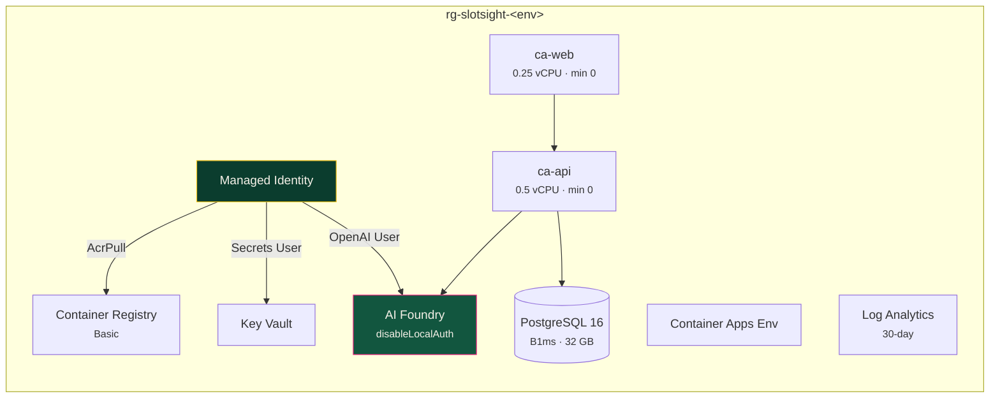

# ☁️ Deploy to Azure

```bash
azd auth login
azd up
```

That is genuinely it. The template provisions everything from nothing —
including its own AI Foundry account and model deployment — so a clean clone
deploys end to end with no pre-existing resources.

---

## What gets created



Roughly **8–12 minutes** on a first provision, most of it PostgreSQL and the
model deployment.

---

## 💰 Cost

Ballpark for an idle demo in a US region. Check
[Azure Pricing](https://azure.microsoft.com/pricing/calculator/) for current
figures, or ask the Azure MCP server.

| Resource | ~Monthly |
|---|---|
| Container Apps (consumption, `minReplicas: 0`) | **$0–3** — scales to zero |
| PostgreSQL Flexible Server B1ms + 32 GB | **~$15–20** ← the bulk of it |
| Container Registry (Basic) | ~$5 |
| Log Analytics (30-day, low volume) | ~$0–3 |
| Key Vault | <$1 |
| AI Foundry | **pay-per-token** — pennies for a demo |
| **Total idle** | **~$25–30/month** |

**PostgreSQL is the only thing that does not scale to zero.** If you are keeping
this around, that is what to stop.

### Tear it down

```bash
azd down --purge
```

> [!IMPORTANT]
> `--purge` matters. Key Vault and AI Foundry soft-delete by default, and a
> soft-deleted resource **blocks a re-deploy under the same name** with an error
> that does not explain itself.

---

## 🔐 The security model

**RBAC, not keys.** Every service-to-service call uses the user-assigned managed
identity:

| Target | Role |
|---|---|
| Container Registry | `AcrPull` |
| AI Foundry | `Cognitive Services OpenAI User` |
| Key Vault | `Key Vault Secrets User` |

**There are no secrets in Bicep and none in `azure.yaml`.** Search for
`listKeys`, `apiKey`, or a connection string — the only one is the Log Analytics
shared key, which the Container Apps environment schema requires.

**AI Foundry sets `disableLocalAuth: true`.** Key-based auth is turned off at the
resource, which means "just use an API key" is not merely discouraged here — it
is impossible.

**One generated secret**, the PostgreSQL admin password: created at provision
time from deployment-scoped entropy, written straight to Key Vault, never an
output, never logged, never in `azd env`.

---

## Before you deploy

```bash
az account show --query "{sub:name, id:id}" -o json
```

Deploying a demo into the wrong subscription happens and is annoying to unwind.

```bash
az bicep build --file infra/main.bicep    # compiles?
azd provision --preview                    # what-if, changes nothing
```

> Compiling is not deploying. A clean `bicep build` proves syntax and nothing
> more.

---

## After you deploy — verify, don't assume

```bash
azd env get-values | grep -i URI

curl -fsS <SERVICE_API_URI>/api/health
curl -fsS <SERVICE_API_URI>/api/floor/summary
```

If `/api/health` reports the database as `degraded`, **the seed job has not
run** — the schema exists but there is no data. Do not call the deploy
successful until this is fixed.

### Seeding the deployed database

```bash
az containerapp job create \
  --name slotsight-seed \
  --resource-group <rg> \
  --environment <container-apps-env> \
  --trigger-type Manual \
  --image <acr>.azurecr.io/slotsight/api:latest \
  --command "slotsight-seed" "--reset" \
  --mi-user-assigned <identity-resource-id>

az containerapp job start --name slotsight-seed --resource-group <rg>
```

Or run it once against the Flexible Server from your machine, with the firewall
temporarily allowing your IP.

---

## 🤖 The conversational path

The integration worth demonstrating: **do the whole thing through the Azure MCP
server.**

Switch to the **Azure Deployer** agent in Copilot Chat, or use `/deploy-azure`.

Try, in order:

> *What Azure subscription am I currently logged into?*

> *What will `azd up` create for this repo, and roughly what will it cost per month?*

> *Run a provision preview and summarise what would change.*

> *Provision it.* ← it will ask you to confirm first

> *Is the API healthy? Check the Container App logs.*

> *The database looks empty. How do I run the seed job?*

The agent uses `azure/*` tools for live resources and `microsoft-docs/*` to
check current API versions rather than recalling them. It is configured to
**refuse to change cloud state without confirmation**, and to treat `azd down`
as requiring an explicit, unambiguous instruction.

---

## Configuration

```bash
azd env set AZURE_LOCATION eastus2
azd env set CHAT_MODEL_NAME gpt-4.1
azd env set CHAT_MODEL_CAPACITY 30
```

Model availability varies by region. If the deployment fails on model capacity,
either pick another region or lower the capacity — the error names which.

---

## When it fails

| Symptom | Cause |
|---|---|
| `AuthorizationFailed` right after provisioning | RBAC propagation. Wait 2–5 minutes and retry. **Never** switch to a key. |
| Model deployment fails on capacity | Region has none left. Try another, or lower `CHAT_MODEL_CAPACITY`. |
| `VaultAlreadyExists` on re-deploy | Soft-deleted from a previous run. You needed `azd down --purge`. |
| Container App won't start | `az containerapp logs show -n <app> -g <rg> --follow` |
| `/api/health` degraded | Seed job has not run |
| `azd deploy` can't find the service | The `azd-service-name` tag must match the key in `azure.yaml` |

More: [troubleshooting](troubleshooting.md)
