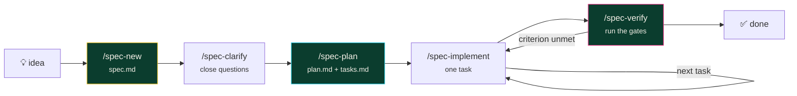

# 📐 Spec-driven development

How this repository was built, and how to build the next feature in it.

---

## The idea

Write the specification first, precisely enough that implementation becomes
mechanical — then let an AI agent do the mechanical part while you review the
decisions.

The value is not that AI writes code faster. It is that **the specification is a
better artifact than the code** for the questions people actually ask six months
later: *why does it work this way? what else did we consider? what did we
decide not to do?*

## The loop



Each stage has a prompt file and a custom agent with a **restricted toolset**,
so the Architect physically cannot start writing code.

---

## The three artifacts

### `spec.md` — what and why, never how

**No library names, no class names, no file paths.** If you are writing "add a
method to `FloorService`", you have drifted into planning.

Required: **Problem** · **Users** · **Desired outcome** · **Acceptance
criteria** · **Out of scope** · **Open questions** · **Constraints**

**Acceptance criteria are the contract.** Write them so a test can be derived
mechanically:

> ❌ "The floor map should be fast and easy to read."
>
> ✅ "1. Renders 840 machines in under 500 ms on a 90-day window.
>     2. Each machine is coloured by `peer_index` band, never raw WPUPD.
>     3. Colour is paired with a shape or label so it is legible without colour
>        vision."

**The out-of-scope list prevents more rework than the in-scope list.** It is
where you record the thing everyone will otherwise assume is included.

### `plan.md` — how

Approach, architecture, files, **alternatives considered**, risks, verification.

The alternatives table is the section readers return to. Be specific about what
you rejected and what would change your mind:

> | Option | Why not |
> |---|---|
> | Compute peer index in SQL with a window function | Cleaner query, but the cohort-size fallback becomes a nested CASE nobody will read, and it cannot be unit-tested without a database. |
> | Rank on raw WPUPD | The obvious approach and completely wrong — it sorts by denomination. |

### `tasks.md` — ordered and verifiable

```markdown
- [ ] **T3 — Peer cohort sizing guard**
      Files: `analytics/floor.py`
      Done when: cohorts below MIN_COHORT_SIZE fall back to the floor average
      and peer_cohort_size is surfaced; `pytest -m golden` still passes.
      Verify: `cd apps/api && uv run pytest tests/test_api.py -k cohort`
```

**Sequence tasks that touch the same file.** Two "parallel" tasks editing one
module is a merge conflict you scheduled deliberately.

**Leave the build green after every task.** A task that ends red is two tasks.

---

## Try it — spec 003 is deliberately unbuilt

[`specs/003-competitive-intel-feed/`](../specs/003-competitive-intel-feed/)
contains a specification with ten acceptance criteria, four open questions, and
**no `plan.md` and no `tasks.md`**.

In Copilot Chat:

```
/spec-clarify    003-competitive-intel-feed
/spec-plan       003-competitive-intel-feed
/spec-implement  003-competitive-intel-feed
/spec-verify     003-competitive-intel-feed
```

Watch what `/spec-plan` does: it reads the spec, searches the codebase for prior
art, checks current library APIs through Context7, and produces a plan with the
files it will touch, the alternatives it rejected, and the risks — including
whether the change threatens the golden tests.

---

## What the worked examples show

[`001-slot-floor-analytics-core`](../specs/001-slot-floor-analytics-core/) is a
complete example — spec, plan, tasks, all checked, with a verification table
mapping each criterion to the gate that proves it.

Its `tasks.md` has a section worth studying: **two tasks added during
implementation.** Both were discovered by running the thing, neither was
anticipated by the plan:

> **T11 — Coerce Postgres `Decimal` at the SQL boundary**
> `SUM()` over `BIGINT` returns `NUMERIC`, which asyncpg hands back as
> `Decimal`. Dividing by a float par raised `TypeError` — and **only against
> Postgres**; the SQLite suite was green throughout.

That is the normal case, and recording it honestly is more useful than a plan
that pretends to have foreseen everything.

[`002-conversational-insights`](../specs/002-conversational-insights/) closes
with three bugs that only appeared when the code actually ran — a missing async
transport, a model parameter name, and an error envelope that was unwrapped
differently than assumed. **None would have failed a code review.**

---

## The constitution

[`.specify/memory/constitution.md`](../.specify/memory/constitution.md) holds
eleven principles every spec inherits. Where a spec and the constitution
disagree, the constitution wins.

Each states the **failure it prevents**:

> **V. Say when the data cannot be trusted.**
> The highest-"winning" machine in this dataset is a metering fault. A
> rank-by-win leaderboard puts it first and invites someone to order eight more
> of a broken unit. An analytics tool that cannot say *"I don't believe this
> number"* is not safe to act on.

Principles that quietly erode were never principles — so amending one requires
changing that file **and** saying so in the spec that motivated it.

---

## When a golden test fails

**Do not adjust the assertion to match the new output.**

The golden tests assert conclusions about a floor whose truth we control. They
are deliberately hard to silence. If one fails, work out which behaviour
changed and whether that was intended. If it was, update the constants in
`seed/scenarios.py` and say why in the commit — where a reviewer will see it.

---

## Using GitHub Spec Kit instead

This repository implements the spec-driven loop with **prompt files**, so it
works with zero external installation.

[GitHub Spec Kit](https://github.com/github/spec-kit) is the official toolkit
for the same idea, with a richer command set (`/speckit.constitution`,
`/speckit.clarify`, `/speckit.analyze`, `/speckit.checklist`).

To layer it on:

```bash
uv tool install specify-cli --from git+https://github.com/github/spec-kit.git
specify init --here --ai copilot
```

It writes its own `.specify/` scaffolding and `/speckit.*` commands alongside
what is here. The `specs/` artifacts in this repo follow a compatible shape, so
they remain readable either way.

---

## Honestly: when not to do this

Spec-driven development is overhead, and overhead has to earn its place.

**Skip it for:** typo fixes, dependency bumps, one-line changes, anything where
writing the spec takes longer than the change.

**Use it for:** anything touching more than two files, anything where the
approach is genuinely uncertain, anything you will need to explain later, and
anything you intend to hand to an AI agent — because a vague spec produces
plausible code that solves the wrong problem, quickly.
