# Plan — 001 Slot floor analytics core

## Approach

A four-module layer under `apps/api/src/slotsight/analytics/`, built bottom-up
so each layer is independently testable and the layer above it cannot cheat.

`metrics.py` holds pure arithmetic with no imports beyond the standard library —
it can be reasoned about, tested, and copied into a notebook without dragging a
database along. `floor.py` owns the single aggregation query everything else
consumes, so there is exactly one definition of "how a machine is doing".
`outliers.py` and `recommend.py` consume that output rather than issuing their
own SQL.

Aggregation happens in SQL; **indexing happens in Python**. Computing cohort
averages needs two passes over the same result set, and at ~840 machines the
extra round trip costs more than the arithmetic.

## Architecture

```mermaid
flowchart TD
    subgraph db[PostgreSQL]
        M[(machines)]
        P[(daily_performance)]
    end

    subgraph analytics["analytics/ — deterministic, LLM-free"]
        MX["metrics.py<br/><i>pure functions</i>"]
        FL["floor.py<br/><i>the one query</i>"]
        OU["outliers.py"]
        RC["recommend.py"]
    end

    R[routers/]
    A["agent/<br/><i>tool-calling shell</i>"]
    MCP[mcp_server.py]

    M --> FL
    P --> FL
    MX --> FL
    FL --> OU
    FL --> RC
    OU --> RC
    FL --> R
    OU --> R
    RC --> R
    R -.->|same functions| A
    A --> MCP

    style analytics fill:#0B3D2E,stroke:#F5C518
    style MX fill:#12563F,stroke:#22D3EE
```

The dotted edge is the important one: `agent/` reaches data **only** through the
same functions `routers/` uses. It never writes a query.

## Files

| File | Change | Why |
|---|---|---|
| `analytics/metrics.py` | new | Pure functions. No DB, no config, no I/O. |
| `analytics/floor.py` | new | The one aggregation query + peer indexing |
| `analytics/outliers.py` | new | Underperformers, top performers, bad data |
| `analytics/recommend.py` | new | Actions with evidence — needs spec 002's market seam |
| `models/__init__.py` | new | ORM. Integer cents. No player table. |
| `db.py` | new | Async engine + session |
| `routers/*.py` | new | HTTP surface |
| `tests/test_metrics.py` | new | Unit — milliseconds |
| `tests/test_scenarios.py` | new | Golden — asserts conclusions |

## Alternatives considered

| Option | Why not |
|---|---|
| **Compute peer index in SQL** with a window function | Cleaner-looking query, but the cohort-size fallback rule (`< 6 units → floor average`) becomes a nested CASE nobody will read, and it cannot be unit-tested without a database. The Python version is six lines and has its own test. |
| **Rank on raw WPUPD** | The obvious approach and completely wrong — it sorts by denomination. This is the mistake the whole spec exists to prevent. |
| **Include zone in the peer cohort** | Would make each cohort more homogeneous, but hides the most interesting finding: a whole zone underperforming its cross-floor peers. Zone is a *result*, not a control. |
| **Store money as `Numeric`** | Exact, but `Decimal` arithmetic infects every downstream function and mixes badly with the float ratios. Integer cents is exact *and* ordinary. |
| **Alembic migrations** | Correct for production, ceremony here — the database is regenerated from a deterministic seed on every run. Documented as a known shortcut rather than hidden. |
| **A single `analytics.py`** | Would be ~900 lines. The four-module split matches the four questions the product answers. |

## Risks

| Risk | Mitigation |
|---|---|
| **Postgres `SUM()` over `BIGINT` returns `Decimal`** and mixes badly with float ratios. Fails against Postgres only — the SQLite test suite stays green. | Coerce with `int()` at the SQL boundary in `machine_metrics`, with a comment saying why. A compose smoke test in CI covers what SQLite cannot. |
| A cohort that is coextensive with a zone has a peer index of exactly 1.000 by construction, so that zone can never be evaluated. | Give the High Limit salon a share of `$1` units so it shares a cohort with the main floor. Realistic, and it makes the zone measurable. |
| Thresholds tuned against synthetic data may not generalise. | Every threshold is a named module constant with a comment, not a literal. Stated openly in the docs. |
| **Golden tests could be silenced** by someone adjusting an assertion to match new output. | The test file says explicitly not to do that, and the constants live in `seed/scenarios.py` where changing them is visible in review. |

## Verification

| Criterion | Gate |
|---|---|
| 1, 9 | `pytest tests/test_metrics.py` |
| 2, 3 | `pytest tests/test_api.py -k index` |
| 4 | `pytest -m golden -k sustained` |
| 5 | `pytest -m golden -k anomaly` |
| 7 | `pytest -m golden -k rolls_up` |
| 8 | `mypy src` + manual review of `to_dollars` call sites |
| 10 | Wall-clock of the full suite |
